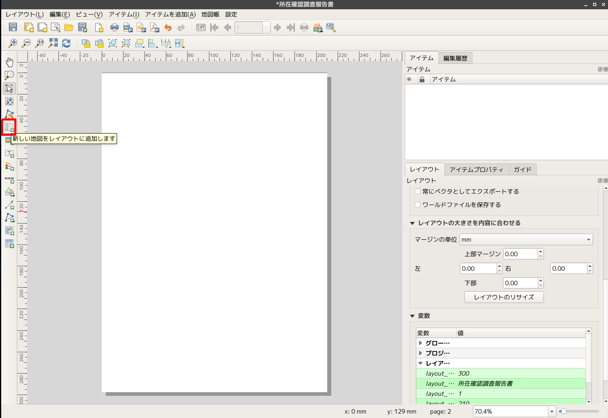
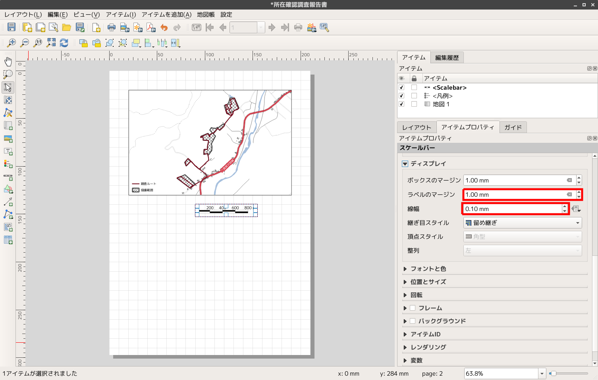
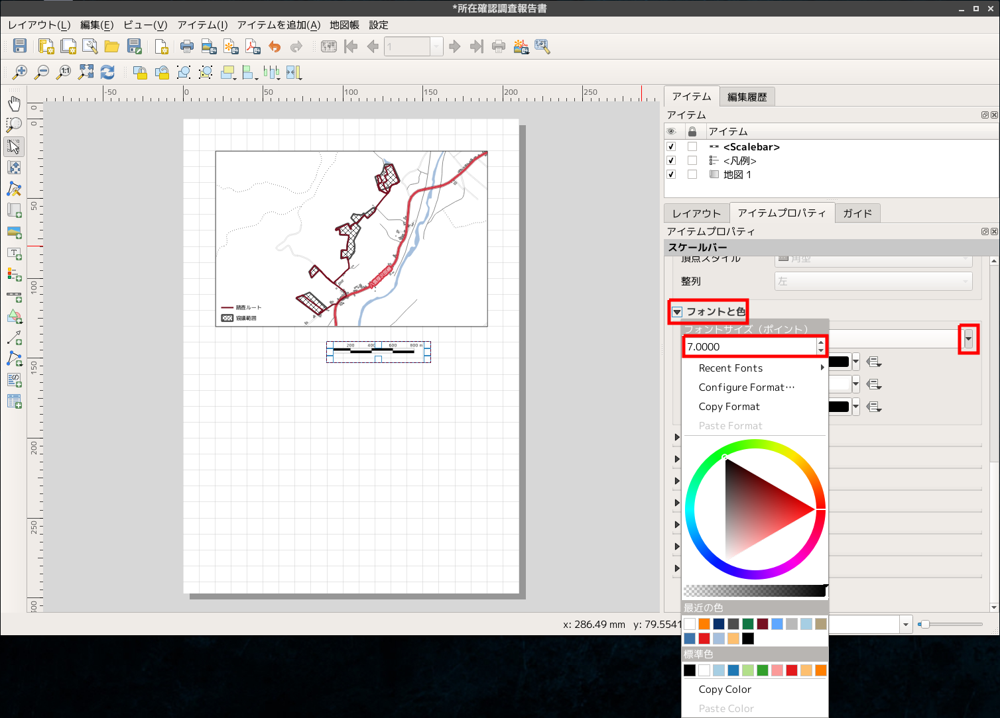

# QGIS印刷編〜所在調査報告書を作成する〜

## この資料について

本資料は2018年9月19日に行われた奈良文化財研究所「遺跡情報記録課程」の「GIS演習」で使用した解説資料です。

## マスターすること

ベクタデータの扱い方をマスターします。ベクタデータはデータベースとしての側面があり、論理演算子を使用して色や線種などを指定することができます。データベースとしてのベクタデータの取り扱いを実習します。

また、QGISは印刷原稿を作成するための「レイアウト」という機能が用意されており、高品質な印刷原稿を作成することができます。調査成果などの日常的な出図にも役に立つ「レイアウト」機能を使った版組を実習します。

- ベクタデータを加工して線種変更、彩色をする
- 演算子を使ったベクタデータの分類と表現
- 「レイアウト」による印刷原稿の作成

## ドキュメント

- [配布資料](https://github.com/IshiiJunpei/QGISforArcVector/blob/master/05%E6%89%80%E5%9C%A8%E7%A2%BA%E8%AA%8D%E8%AA%BF%E6%9F%BB%E5%A0%B1%E5%91%8A%E6%9B%B8%E3%82%92%E4%BD%9C%E6%88%90%E3%81%99%E3%82%8B.pdf)

-  [スライド](https://IshiiJunpei.github.io/QGISforArcVector)

# QGIS印刷編

## 所在確認調査報告書をつくる

Created by Ishii Junpei ( [@ishiijunpei](https://twitter.com/ishiijunpei))


## 作業の内容

- ベクタデータを加工して線種変更、彩色をする
- 演算子を使ったベクタデータの分類と表現
- 「レイアウト」による印刷原稿の作成

---
「buildings」を右クリック


---
「エクスポート」→「地物の保存」


---
- 「座標参照系」を「JGD2000/UTM zone 54N」に変更
- ファイル名を「buildings_utm54」に変更


- 「road」も座標参照系変更
- 「WGS84」→「JGD2000/UTM zone 54N」

---
「WL_polygon_utm54」→「レイヤプロパティ」→「シンポロジ」


---
### 課題

水域に灰色の線が入るのを解消したい


---
「road」→「シンポロジー」→「Categolized」


---
- 「カラム」→「タイプ」
- 「分類」


---
「Ruleｰbased」に切り替え


---
左下の「＋」マークをクリック


---
- 「色」→好きな色に変更
- 「幅」→太め（1以上に　単位はミリ）


---
- 「フィルタ」→検索式を入力


```
"type"  LIKE 'trunk'
```

---
### 国道が赤くなった


---
### 国道と道道を赤くする


```
"type"  LIKE  'trunk' OR "type"  LIKE  'primary'
```

---
### 国道と道道を塗り分ける


```
"type"  LIKE  'trunk'
"type"  LIKE  'primary'
```

---
国道と道道が塗り分けられた


---
## 「スタイル」を指定する

- あらかじめ登録した書式を読み込む
- 「スタイル」→「スタイルのロード」


---
「OSM_道路_Maplink風.qml」を選択


---
### スタイル（OSM_道路_Maplink風.qml）が反映された地図


### 課題

- 建物を灰色に塗りつぶし
- 建物輪郭を黒色にする


「協議範囲」シェープファイルの読み込み


- 「協議範囲」右クリック
- レイヤの領域にズーム


---
えらんだレイヤの地物が全部表示される


---
### GPSデータを読み込む

 「ベクタ」→「GPSツール」


---
- 「GPXファイルをロード」タブを選択
- 「地物タイプ」→「トラック」


---
### 課題〜好みの描画に調節〜

- GPS線種を調整
- 協議範囲の塗りつぶしと線種を調節


---
「プロジェクト」→「レイアウトマネージャー」


---
「クリエイト」をクリック


---
「レイアウト名称」を入力


---
印刷用のレイアウト


---
- 「レイアウト」タブ→「レイアウトのリサイズ」
- 現在のレイアウトを消去する


---
「レイアウト」→「ページを追加」


---
「方向」→「縦」


---
「新しい地図を追加」


---
描画領域をドラッグして指定


---
「アイテムプロパティ」タブ→「縮尺」


---
「アイテムプロパティ」タブ→「フレーム」


---
「新しい凡例をレイアウトに追加」


---
- ドラッグして凡例を追加
- すべての地物が表示される


---
- 「アイテムプロパティ」→「凡例アイテム」
- 「自動更新」→チェックを外す
- 不要な地物を選択する（トラックデータと協議範囲以外）
- 「マイナス」ボタンをクリック


---
- 凡例アイテム（トラックデータ）をダブルクリック
- 「アイテムテキスト」→表示名を入力


---
- 「フォント」→「アイテムフォント」
- フォントとフォントサイズを変更（9ptぐらい）


---
- 「新しいスケールバーを追加」
- ドラッグしてスケールを追加


---
- 「スタイル」→「ダブルボックス」
- 「線分列」→「左0」
- 「固定幅」→「200」単位


---
- 「ディスプレイ」→「ラベルのマージン」→「1.0mm」
- 「線幅」→「0.1mm」



---
「フォントと色」→「フォント」→「7pt」



---
- 凡例とスケールを適当な位置に配置して
- レイヤをロック


---
- 「新しい地図をレイアウトに追加」
- ドラッグして地図を配置


---
 「アイテムプロパティ」→「縮尺」→300000


---
### 2つの地図で表現を変える
1つのレイアウト内に2つ以上の地図が描画されている場合に、異なる地物や表現を適用できます。

---
「地図テーマの管理」→「テーマの追加」


新しいテーマの名称を「詳細図」とする


---
- 「協議範囲」と「トラックデータ」を非表示
- 「地図テーマの管理」→「テーマの追加」


---
- 「地図テーマにしたがう」にクリック
- 地図テーマを「広域図」に指定


---
「地図テーマ」を設定するとレイアウト画面で表示するレイヤの組み合わせを選べます。


---
### 図形を追加する

- 図形の追加
- 四角形の追加


---
### テキストを追加する

- 「新しいラベルを追加」
- 「アイテムプロパティ」→「主なプロパティ」→テキストを記述


---
### 写真を追加する

- 「新しい画像を追加」
- ドラッグして範囲を指定
- 「画像ソース」クリック


---
写真の追加（photo01.JPG）


写真の追加（photo02.JPG）


---
### ラベルを設定する

- 「踏査範囲」をダブルクリック
- 「ラベル」→最上段を「Single labels」に切り替え


---
- 「ラベル」→「地点名」を選択
- 「フォント」→サイズや種類は適当に


---
- 「配置」に切り替え
- 「境界線の使用」→「許容される位置」を「左」→「ラインの方向に依存した位置」
- 「距離」を0.5


---
- 「描画」に切り替え
- 「このレイヤのすべてのラベルを表示する」にチェック


---
### ラベルの表示


---
## 地図帳機能

「地図帳」機能を使うと複数の地図をまとめて出力することができます。複数の調査地点を同一の様式で自動的に出力する場合などに活用できます。

- 「プロジェクト」→「レイアウトマネージャー」
- 「所在調査報告書」を選択して「Duplicate」をクリックするとレイアウトを複製できます。


「所在調査報告書_地図帳」とリネームします。


---
「地図帳」→「地図帳の設定」


---
- 「地図帳」タブ
- 「地図帳を作成する」をクリック
- 「被覆レイヤ」→「協議範囲」


---
- 地図を選択
- 「地図帳による制御」にチェック
- 「地物周りの余白」→「100%」


---
### オブジェクトのテーブルを参照する

図のタイトルを選択して、以下のように入力します。地図帳機能で「協議範囲」ごとに地図を出図した際に、協議区域名が自動的に入力されるようになります。

```
[%地点名%]　所在確認調査実施位置図

```


---
「地図帳」→「地図帳のプレビュー」


---
「地図帳のエクスポート」→「PDFとしてエクスポート」


---
協議区域ごとにPDFページを出力


---
### おまけ〜古地図風印刷〜
チラシ作成にも使えます！！


